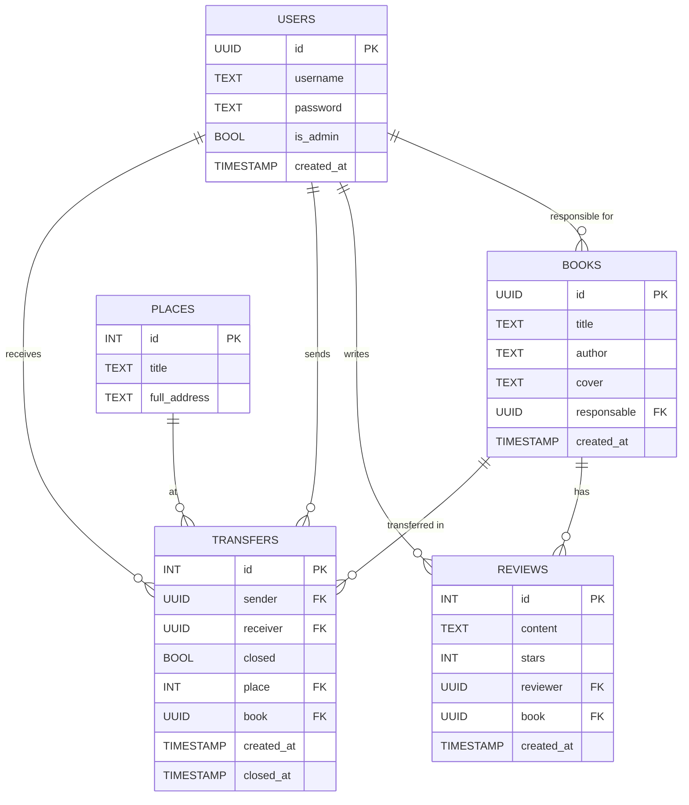

# Bookswap

It's a course project at first course of bachelor in [Central University]()

## Ссылка на ТЗ:

https://git.culab.ru/bsc-development-basics-2nd-semester/dev-basics-2025-longreads/-/tree/main/course-project?ref_type=heads

# Database

