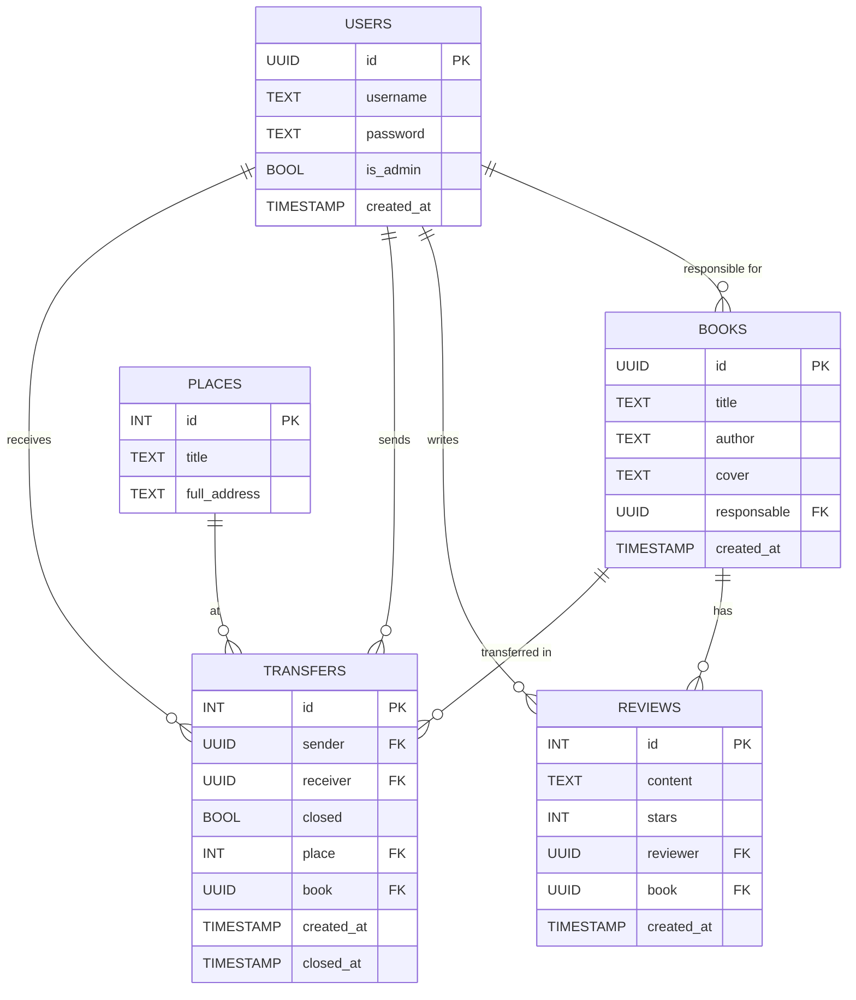

# Курсовой проект

В этом репозитории вам нужно его реализовать

## Ссылка на ТЗ:

https://git.culab.ru/bsc-development-basics-2nd-semester/dev-basics-2025-longreads/-/tree/main/course-project?ref_type=heads

# Database

