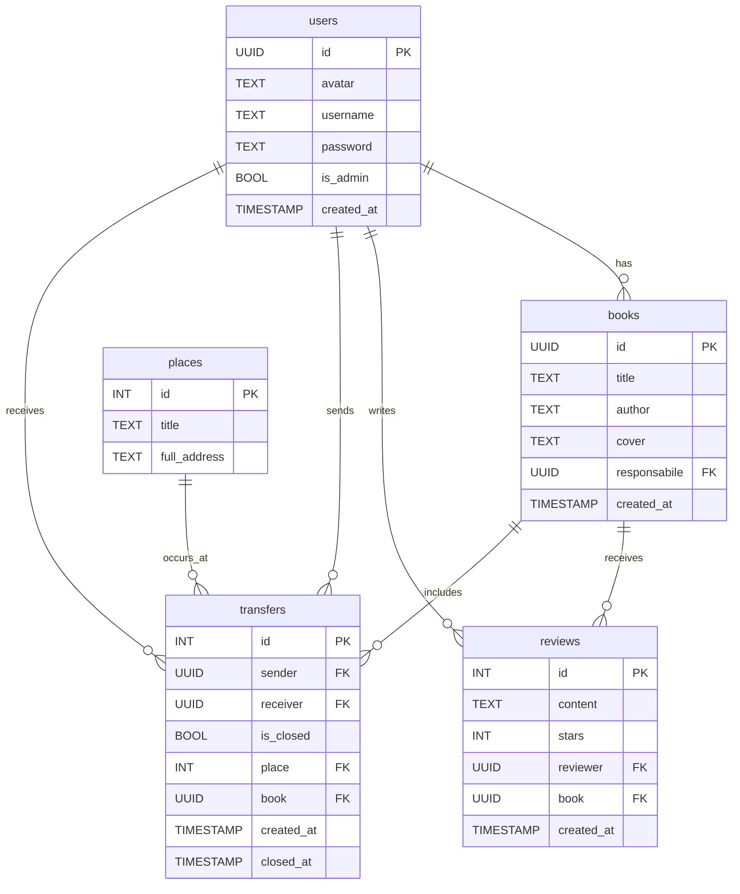

## Database scheme

```mermaid
erDiagram
    users {
        UUID id PK
        TEXT avatar
        TEXT username
        TEXT password
        BOOL is_admin
        TIMESTAMP created_at
    }

    books {
        UUID id PK
        TEXT title
        TEXT author
        TEXT cover
        UUID responsabile FK
        TIMESTAMP created_at
    }

    reviews {
        INT id PK
        TEXT content
        INT stars
        UUID reviewer FK
        UUID book FK
        TIMESTAMP created_at
    }

    places {
        INT id PK
        TEXT title
        TEXT full_address
    }

    transfers {
        INT id PK
        UUID sender FK
        UUID receiver FK
        BOOL is_closed
        INT place FK
        UUID book FK
        TIMESTAMP created_at
        TIMESTAMP closed_at
    }

    users ||--o{ books : has
    users ||--o{ reviews : writes
    users ||--o{ transfers : sends
    users ||--o{ transfers : receives
    books ||--o{ reviews : receives
    books ||--o{ transfers : includes
    places ||--o{ transfers : occurs_at
```
